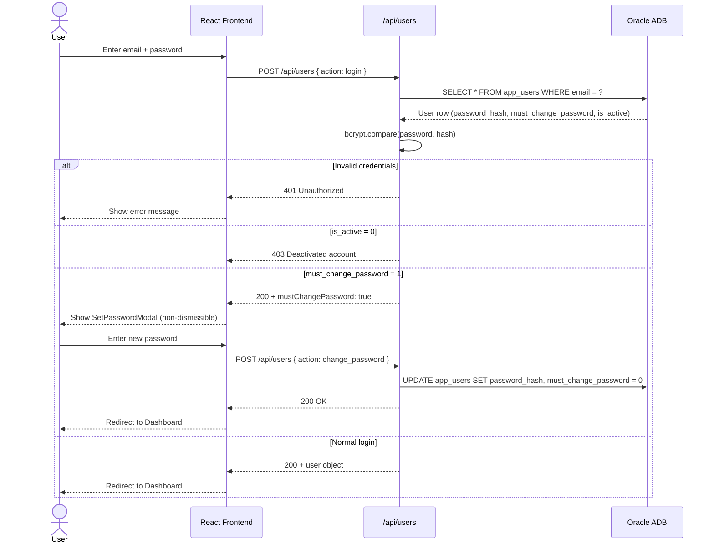
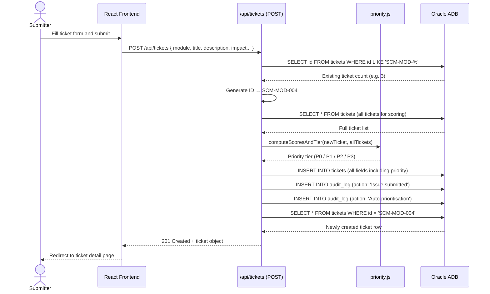
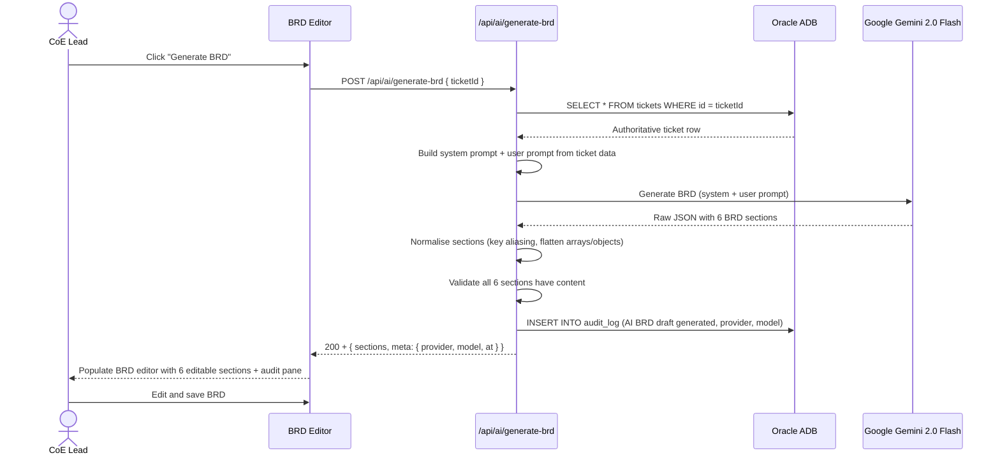
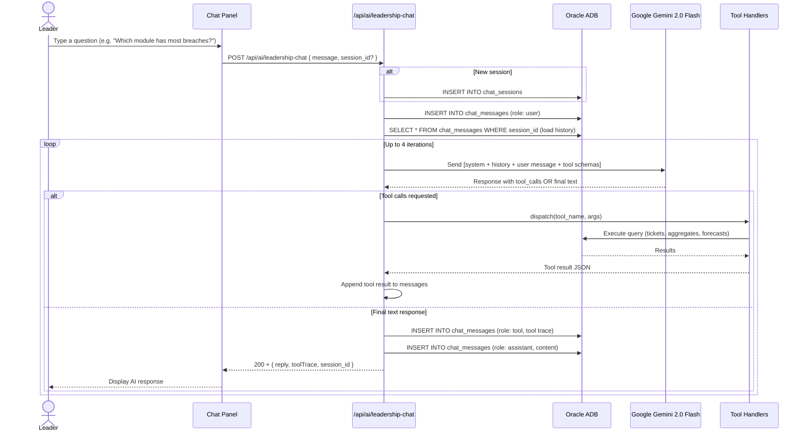
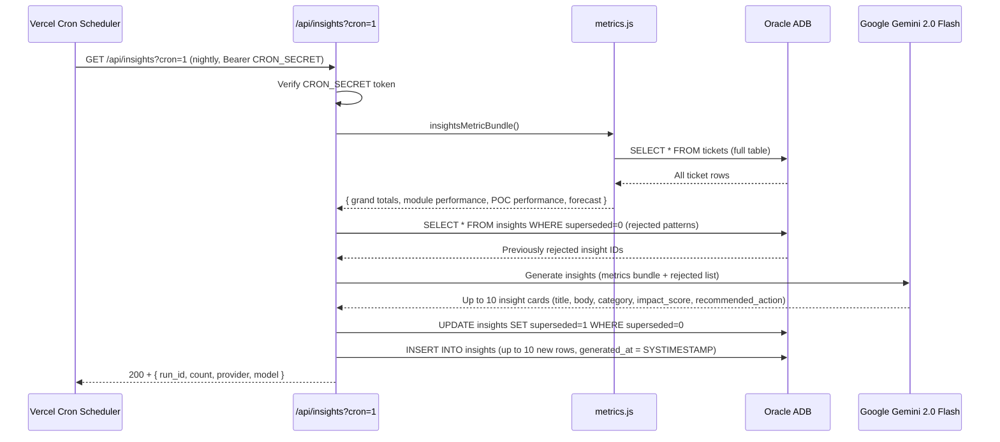
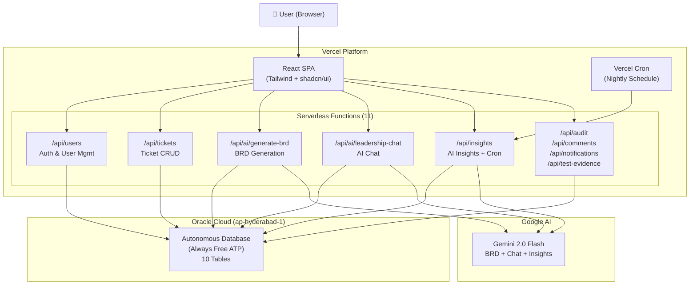

# SCM Intelligent Issue Portal — Application Flow & Gemini Cost Forecast

---

## 1. Application Flow Diagrams

### 1.1 Authentication Flow

---

### 1.2 Ticket Creation Flow

---

### 1.3 BRD Generation Flow (AI)

---

### 1.4 Leadership Chat Flow (AI with Tool Use)

---

### 1.5 Nightly Insights Cron Flow

---

### 1.6 Full System Architecture Flow

---

## 2. Gemini API Cost Forecast

### 2.1 Gemini 2.0 Flash Pricing (as of 2025)

| Tier | Input tokens | Output tokens |
|---|---|---|
| **Free tier** | 1,500 requests/day, 15 req/min | 1,500 requests/day |
| **Paid (≤128K context)** | $0.075 per 1M tokens | $0.30 per 1M tokens |
| **Paid (>128K context)** | $0.15 per 1M tokens | $0.60 per 1M tokens |

> All SCM portal requests stay well within 128K context.

---

### 2.2 Token Estimate Per Feature

#### BRD Generation (per ticket)

| Component | Tokens |
|---|---|
| System prompt | ~450 |
| Ticket data (title, desc, impact, SLA) | ~400 |
| **Total input** | **~850** |
| 6 BRD sections output | ~1,000 |
| **Total output** | **~1,000** |
| **Total per call** | **~1,850 tokens** |

**Cost per BRD:** `(850 × $0.075 + 1,000 × $0.30) / 1,000,000 = $0.000364`

---

#### Leadership Chat (per conversation turn)

| Component | Tokens |
|---|---|
| System prompt | ~800 |
| Conversation history (avg 3 prior turns) | ~1,500 |
| User message | ~100 |
| Tool results (1–2 tool calls) | ~1,000 |
| **Total input** | **~3,400** |
| AI response | ~500 |
| **Total output** | **~500** |
| **Total per turn** | **~3,900 tokens** |

**Cost per chat turn:** `(3,400 × $0.075 + 500 × $0.30) / 1,000,000 = $0.000405`

---

#### Nightly Insights (per cron run)

| Component | Tokens |
|---|---|
| System prompt | ~600 |
| Metrics bundle (all tickets summarised) | ~4,000 |
| Rejected patterns context | ~300 |
| **Total input** | **~4,900** |
| 10 insight cards output | ~2,500 |
| **Total output** | **~2,500** |
| **Total per run** | **~7,400 tokens** |

**Cost per nightly run:** `(4,900 × $0.075 + 2,500 × $0.30) / 1,000,000 = $0.001118`

---

### 2.3 Monthly Cost Scenarios

#### Small Team (5–10 users, pilot phase)

| Activity | Volume/month | Cost |
|---|---|---|
| BRD generations | 20 BRDs | $0.007 |
| Leadership chat turns | 100 turns | $0.041 |
| Nightly insights | 30 runs | $0.034 |
| **Total** | | **$0.08/month** |

> Entirely within free tier (1,500 req/day). **Effective cost: $0.00**

---

#### Medium Team (20–50 users, active use)

| Activity | Volume/month | Cost |
|---|---|---|
| BRD generations | 150 BRDs | $0.055 |
| Leadership chat turns | 500 turns | $0.203 |
| Nightly insights | 30 runs | $0.034 |
| **Total** | | **$0.29/month** |

> Still well within free tier limits. **Effective cost: $0.00**

---

#### Large Team (100+ users, heavy use)

| Activity | Volume/month | Cost |
|---|---|---|
| BRD generations | 500 BRDs | $0.182 |
| Leadership chat turns | 3,000 turns | $1.215 |
| Nightly insights | 30 runs | $0.034 |
| **Total (paid tier)** | | **~$1.43/month** |

> Exceeds free tier only at high volume. Even then, under $2/month.

---

### 2.4 Free Tier Headroom

The Gemini free tier allows **1,500 requests/day**. Here's how many operations that covers:

| Feature | Requests used | Daily free allowance | Days to hit limit |
|---|---|---|---|
| BRD generation | 1 req/BRD | 1,500 | Need 1,500 BRDs/day |
| Chat turns | 1 req/turn | 1,500 | Need 1,500 turns/day |
| Nightly insights | 1 req/night | 1,500 | 1,499 remaining after cron |

**Conclusion:** The free tier comfortably covers any realistic usage for a single-organisation SCM portal. Paid costs only kick in at enterprise scale, and even then remain under $5/month.

---

### 2.5 Cost Optimisation Options (if needed at scale)

| Option | Saving |
|---|---|
| Cache BRD prompts for identical tickets | Eliminates repeat calls |
| Truncate chat history to last 5 turns | Reduces input tokens ~40% |
| Run insights every 3 days instead of nightly | Saves 20 req/month (negligible) |
| Use `gemini-2.0-flash-lite` for chat | ~50% cheaper, slightly lower quality |
| Batch multiple tool results in one turn | Fewer API calls per chat session |
